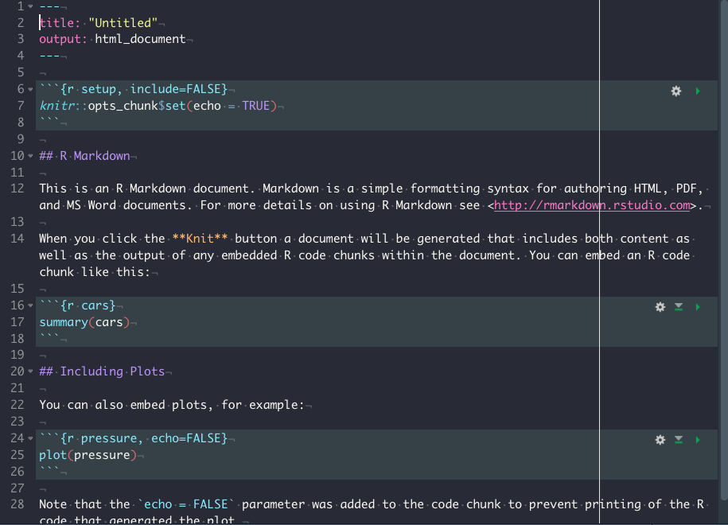

# Rmarkdown {#rmarkdown}

Rmarkdown是Rstudio公司出品的.所有markdown的语法都支持.但是加入了很多强大的功能,因此可以做更多原生markdown无法完成的任务.成为数据分析以及报告自动化和重复化领域一个非常常用的工具.

可以参考下面的书,是rmarkdown的作者Yihui Xie写的.

https://bookdown.org/yihui/rmarkdown/installation.html


也可以查看这个视频简介.

<iframe src="https://player.vimeo.com/video/178485416?color=428bca&title=0&byline=0&portrait=0" width="100%" height="100%" frameborder="0" allow="autoplay; fullscreen" allowfullscreen></iframe>
<p><a href="https://vimeo.com/178485416">What is R Markdown?</a> from <a href="https://vimeo.com/rstudioinc">RStudio, Inc.</a> on <a href="https://vimeo.com">Vimeo</a>.</p>

## 安装

需要安装R和Rstudio.

```markdown
install.packages('rmarkdown')
```

如果想要转换为PDF格式,需要安装LaTex.

```markdown
install.packages("tinytex")
tinytex::install_tinytex()  # install TinyTeX
```

## Rmarkdown结构

Rmarkdown可以分为三部分,分别是`YAML`, `文本部分`以及`代码块`.

1. YAML

YAML在每个rmakdown文件的最开头,定义了Markdown文件的很多性质.YAML是指YAin’t Markup Language, https://en.wikipedia.org/wiki/YAML.

```markdown
---
title: "Hello R Markdown"
author: "Awesome Me"
date: "2018-02-14"
output: html_document
---
```

YAML用`---`包围起来.

2. 文本部分

YAML下面就是文本部分,其实也就是Markdown.

3. 代码块

在Rmarkdown中,可以插入可以执行的代码块,不近包括R,还包括pyton,SQL等等.



上图显示的就是一个完整的Rmarkdown文件.

## YAML

`YAML`是在Rmakdown中控制很多内容的部分.通过参数设置,可以控制比如输入格式,输出主题等等.

## R代码块

R代码块的格式为:

如何设置格式文件,可以参考下面文章:

https://rmarkdown.rstudio.com/articles_docx.html

或者看下面的视频:

<iframe src="https://player.vimeo.com/video/110804387" width="640" height="400" frameborder="0" allow="autoplay; fullscreen" allowfullscreen></iframe>
<p><a href="https://vimeo.com/110804387">Create A MS Word Template for R Markdown</a> from <a href="https://vimeo.com/yihui">Yihui Xie</a> on <a href="https://vimeo.com">Vimeo</a>.</p>

