# Rmarkdown拓展 {#rmarkdown_beyond}

Yihui Xie以及Rstudio基于Rmarkdown写了好几个用来创建网站等的包.

## Blogdown

使用基于Rmarkdown的包`blogdown`可以很方便的创建网站.比如一个个人网站.关于详细的blogdown,可以参考下面的网址:

https://bookdown.org/yihui/blogdown/

### 需要准备的东西

* Rstudio和R

* 本地安装git和一个github账户

需要确保已经将ssh key pub添加到了github账户中.详细信息可以参考:


### 安装

安装`blogdown`包.在R中.

```markdown
## Install from CRAN
install.packages('blogdown')
```

`blogdown`是基于`Hugo`的,所以需要安装Hugo.

```markdown
blogdown::install_hugo()
```

### 创建项目

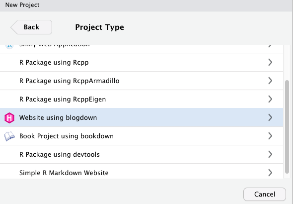

推荐使用这个主题:gcushen/hugo-academic

也可以使用下面的代码:


```r
blogdown::new_site(theme = 'gcushen/hugo-academic')
```

### 预览

项目建好之后,就会有一个demo的网站在.输入代码预览网站:


```r
blogdown:::serve_site()
```

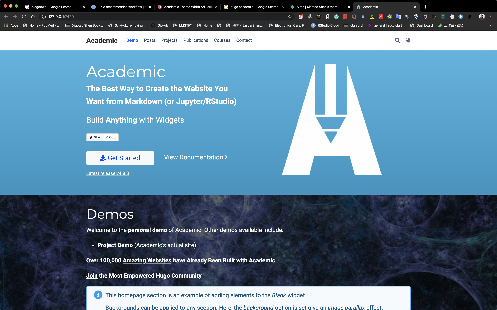

### 使用Rstudio IDE来管理网站

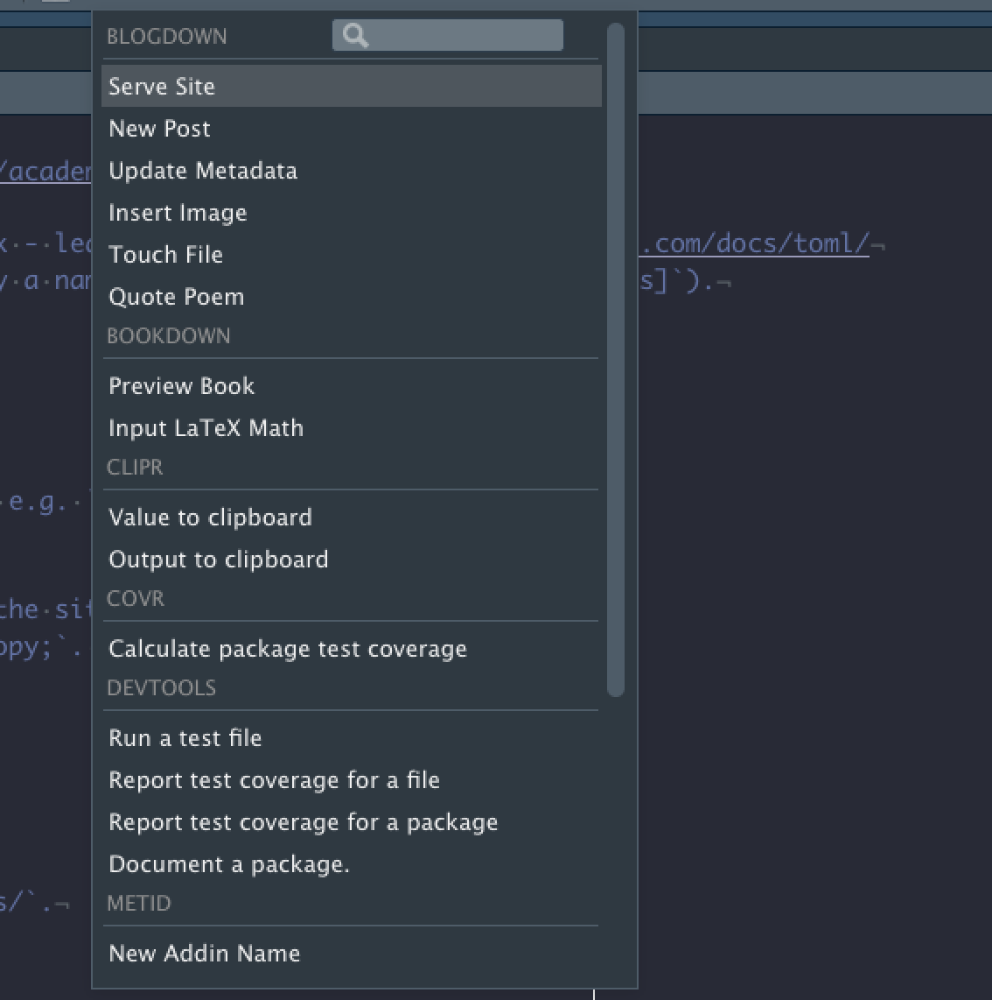

Rstudio的`Addins`中有很多的功能可以方便的用来管理网站.当然他们也都有对应的命令行工具.

* `Serve Site`:对应着`blogdown::serve_site()`.用来对网站进行build,并进行预览.

* `New Post`:对应着`blogdown::new_post()`,用来添加新的post.

其他的功能直接可以打开看看,

### 更改为其他的主题

Hugo有很多主题,都是别人已经做好的,可以直接使用.

官网如下:

https://themes.gohugo.io/

找到自己喜欢以及合适的主题之后,找到该主题所在的github用户名和repo名字,然后使用下面的代码进行安装:


```r
blogdown::install_theme('user.name/repo.name')
```

比如我们使用下面的主题:

https://github.com/kakawait/hugo-tranquilpeak-theme

最好的办法其实是直接新建一个网站,然后使用那个主题,因为不同的主题的配置等等都是非常不同的.

### 发布自己的网站

在本地创建好自己的网站之后,下面需要做的就是将自己的网站发布在网上,使别人可以通过url看到自己的网站.

推荐将网站所有内容托管在github上,然后发布在netlify上.

打开netlify网站(https://www.netlify.com/),可以直接使用github账号登陆.

1. 生成发布文件

输入下列代码:


```r
blogdown::hugo_build()
```

得到下面结果:

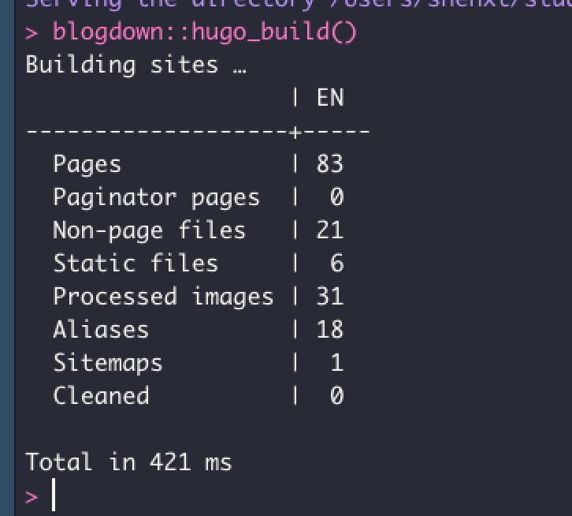

然后在目录下有`public`文件夹,说明已经准备好.

2. 登陆netlify网站

登陆netlify网站,可以使用github账号登陆.

然后将`public`文件夹直接拖动到提示区域即可.

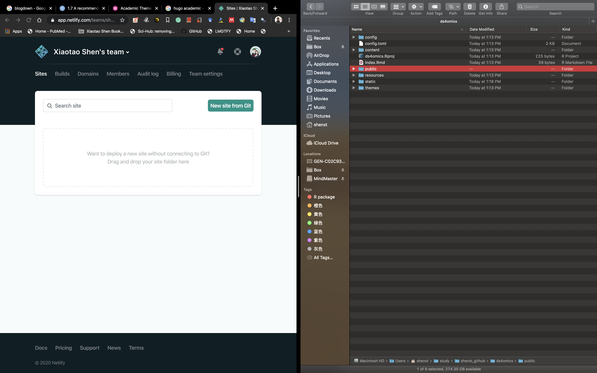

然后就会自动发布(deployment).

这时候他会自动给一个网址(url),比如https://quirky-austin-f482bf.netlify.com/.

3. 绑定github自动发布

每次更新之后,我们都需要将`public`文件夹手动拖动到netlify中,有些麻烦.可以将我们的网站托管在github上,然后将github repo和netlify绑定,从而在每次更新并同步到github之后,让netlify自动更新发布.

首先在github上创建和本地仓库同名的远程仓库.

然后参考git部分的内容,先创建远程仓库并提交,在terminal中:

```markdown
git config user.name
git config user.email
git init
git add .
git commit -m 'new website'
```

然后推送到远程仓库:

```markdown
remote add origin git@github_shenxt:shenxt/ds4omics
git remote -v
git push -u origin master#第一次推送
```

这时候可以看到,本地仓库内容已经被推送到远程仓库了.

设置netlify:

在netlify,点击`Site Setting` -> `Build&deploy` -> `Link site to git`

然后按照提示一步步进行即可.

另外,需要设置下面内容:

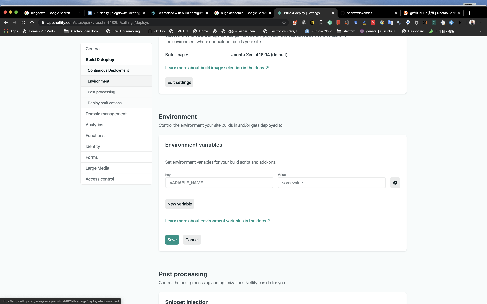

hugo版本可以在R中观察.


```r
blogdown::hugo_version()
```


这样,以后再进行改动,然后使用git将其推送到github,netlify就会自动同步并发布.

4. 设置自定义域名

我们可能需要设置自己的域名.

如果没有买域名,那就只能使用netlify而二级域名,二级域名可以进行设置.

在`site sitting`->`site information`中,点击`change site name`,就可以设置自己的二级域名.比如我们这里改成`ds4omics.netlify.com`.

如果我们购买了自己的域名,可以在[goDaddy](https://www.godaddy.com/offers/domains/noprice?isc=goodbr01&gclid=Cj0KCQjwpLfzBRCRARIsAHuj6qXFolBcCQVKrRZVwzZkywSjzrq1XCq1UoWMls8jdYX-gnfVSNyhiVgaAuKCEALw_wcB&gclsrc=aw.ds)购买.

然后也可以设置为自己的域名.

在netlify主页上,点击`Set up a custom domain`.然后填入自己购买的域名,比如`shenxt.me`,然后按照提示一步步进行即可.


### 发布到github上

也可以将网站发布到github pages上.

具体可以参考https://bookdown.org/yihui/blogdown/github-pages.html.

下图是我自己的个人博客,也是使用blogdown建立的.

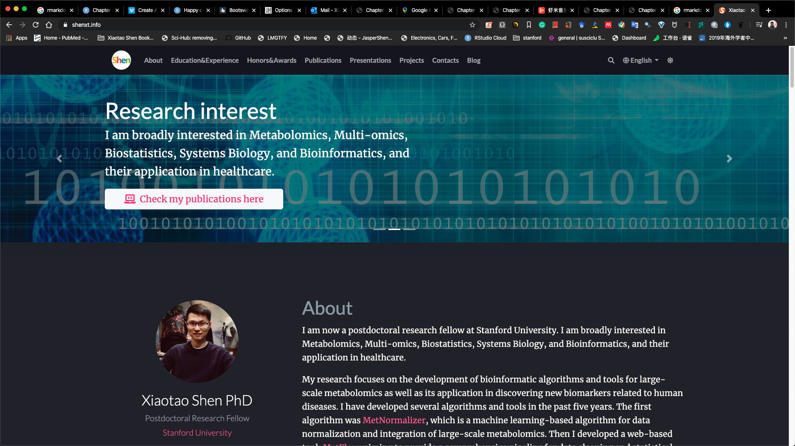

## Bookdown

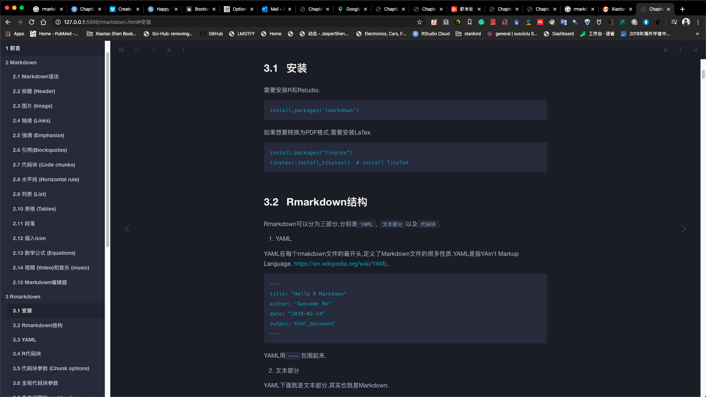

## Presentation

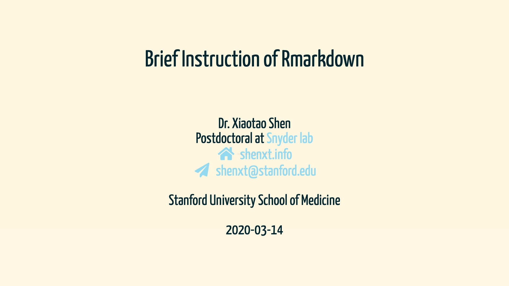

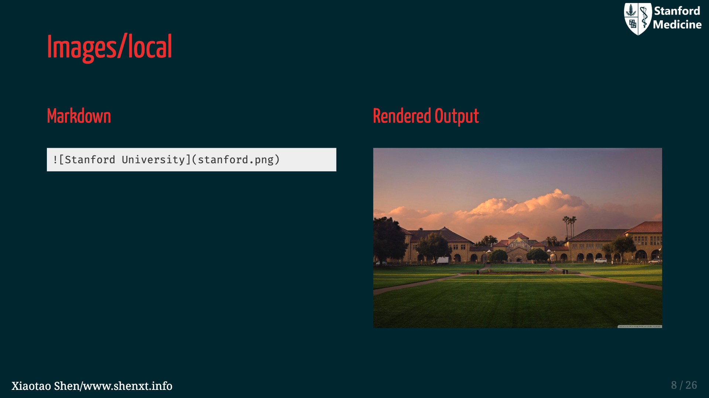

## Pagedown


## Pkgdown

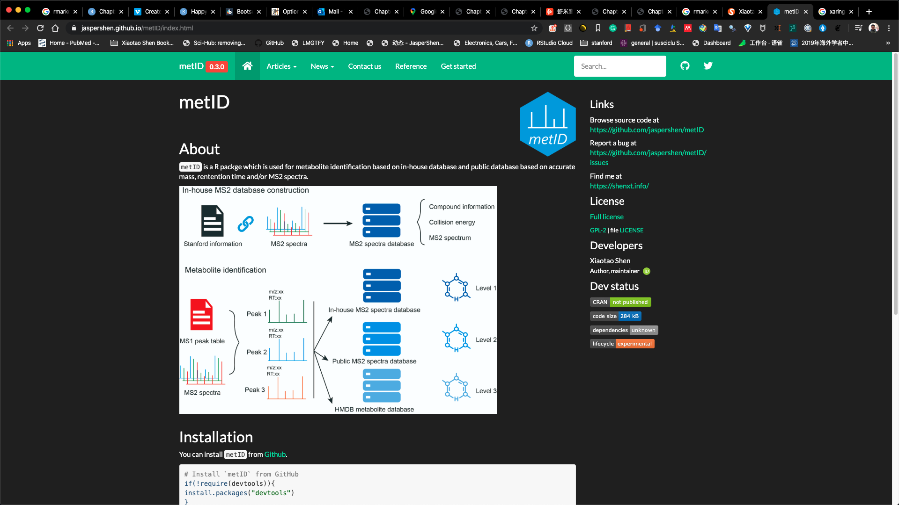
