# Git和github {#git}

git是版本控制系统,而github是开源代码托管平台,提供的是基于git的开源代码托管服务.对于一个团队来说,即使没有github,也可以通过自己搭建git服务器来进行代码的管理,甚至还有一些其他的基于git的代码托管平台使用,比如gitlab,gitee(码云)等.

## 安装git

Mac和Linux是默认安装git的,打开terminal,输入`git version`,如果输出git版本号,则说明已有git.

windows安装git可以直接到官网下载,然后安装即可.官网如下:

https://git-scm.com/downloads

安装结束之后,在开始菜单如果有`git bash`,则说明安装成功.

## 注册github账户

1. 打开github官网注册界面

https://github.com/join?source=header-home

2. 填入自己的账户名,邮箱和密码.

选择`free` plan即可.


3. 选择或者填写一些内容.

4. 验证邮箱

## Git基础知识

`git`是Linux的作者写的.是一个分布式的版本控制软件.

主要功能:

* 备份代码.

* 版本管理.

* 协作办公.

git的基本概念:

工作区(work directory):简单来说就是你的电脑里的目录,也就是某个本地文件夹.

仓库(Respository):工作区有一个隐藏目录`.git`,这个不算是工作区,而是git的仓库,也称之为版本库,这里存储的就是所有代码的版本.

暂存区(stage或者index):git的仓库中存放了很多东西,其中最为重要的就是暂存区.

远程仓库(remote directory):本地仓库的东西如果需要托管到github上,就需要在github上创建一个仓库(远程仓库),然后将本地仓库和远程仓库联系起来,这样就可以将本地仓库的内容推送到远程仓库.


## Git配制

### 安装git之后,需要进行一些全局设置,比如用户名邮箱.

> 主要,下面的所有操作,命令,max和linux'是在`终端(terminal)`中进行的,在windows中,是在`git bash`中.

设置的主要命令是`git config`:

```markdown
git config --global user.name "your name" 
git config --global user.email "your email" 
```
其中,`--global`是指全局配置,如果不写(或者写为`local`),则只为当前仓库(repository)配置.

如果有多个git用户,这时候需要先确定某个仓库使用的哪个账户.

```markdown
git config user.name
git config user.email 
```

查询全局的git账户信息:

```markdown
git config --global user.name
git config --global user.email 
```

如果想要去掉全局用户和邮箱设置.

```markdown
git config --global --unset user_name
git config --global --unset user_email
```

### 生成秘钥

```markdown
ssh-keygen -t rsa -C "shenxt1990@163.com"
```
然后会在`~/.ssh/`文件夹中会产生秘钥文件,我们只需要将公钥(`pub`后缀)的内容拷贝到github中即可.

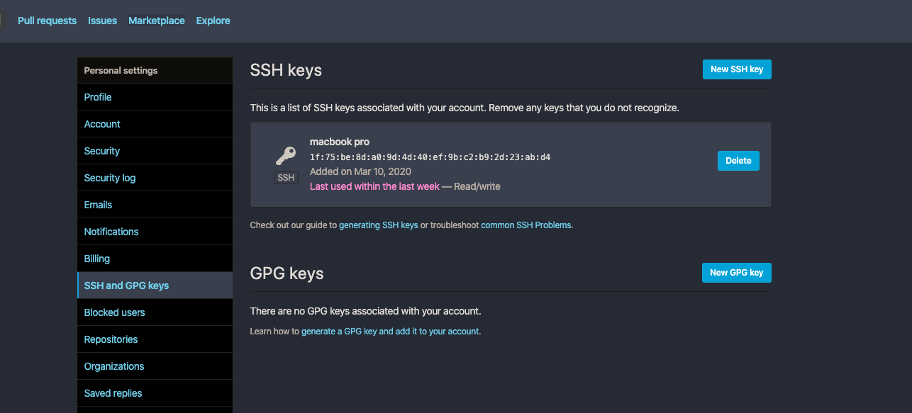

对于windows用户,请参考这个帖子:

https://www.jianshu.com/p/95262f5eba7a

## Git基本操作

### 创建本地git仓库(reop)

使用`git init`命令

首先,创建一个你要当作仓库的文件夹,然后将其设置为工作路径,然后执行.

```markdown
mkdir git_test#创建本地文件夹
cd git_test#进入到该文件夹将其作为工作目录
git init#创建本地git仓库
```
这时候查看目录结构,就可以看到创建了一个名为`.git`的子目录,这就说明创建版本库成功了.

```markdown
ls -la
```

### 将文件添加到版本库

要将一个文件纳入到版本管理,首先需要将其添加到暂存区(stage),然后才能提交到仓库中.

* 使用`git add`命令将文件添加到暂存区:

比如我们首先新建一个名为`README.md`的文件,然后将其添加到暂存区.

```markdown
touch README.md#创建文件
git add README.md#将该文件加入到暂存区
```
当然也可以使用下面命令将所有修改添加到暂存区:

```markdown
git add .
```

`.` 是正则表达式,代表任意文件.但是空文件夹是不会添加到暂存区的.

* 使用`git commit`命令将暂存区文件提交到仓库中.

```markdown
git commit #如果暂存区有文件,则将其中的文件提交到仓库
git commit -m "your note for this commit" #用于注明提交的内容,变更等信息,方便溯源
```

如果直接使用`git commit`提交,不带注释信息,则会先弹出评论界面,需要评论.

注意这时候是使用vi打开的文件,所以需要掌握一点vi的基础知识.参考下面帖子:

https://www.cnblogs.com/itech/archive/2009/04/17/1438439.html

简单来说,首先在命令行模式下按下字母`i`进入插入模式,在该模式下进行信息的输入.输入结束之后,点击`ESC`退回到命令行模式,然后再输入冒号(`:`).输入wq,保存文件修改退出vi编辑器.


### 查看仓库状态

不论我们是新建了文件,将文件加入暂存区,或者是其他修改等,我们都可以使用`git status`来查看当前的仓库状态.

如果当前没有任何变动.


如果我们新建了一个文件,然后再次查看状态:

因为我们还没有将其添加到暂存区,因此显示该新建文件为 `Untracted files`

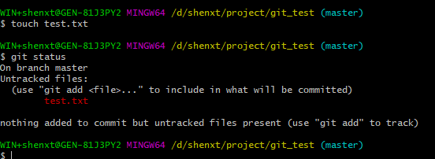

将文件放入暂存区,然后再查看状态:

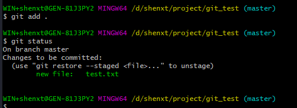

然后再将其进行提交,查看状态.

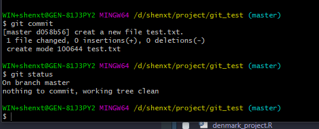

### 查看仓库中的具体修改

如果做过之后修改,我们忘了做了哪些修改,可以使用`git diff`命令来查看具体修改内容.

```rmarkdown
git diff #查看所有改动
git diff README.md #查看具体文件的改动
```
比如我们在`test.txt`文件中加入一行,然后查看:

```markdown
git diff test.txt
```

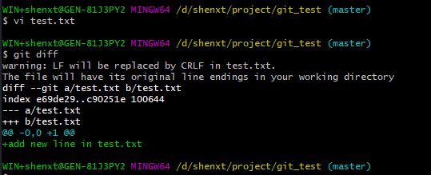

可以看到记录了对该文件的修改内容.

> 注意,如果你修改之后已经将其存入暂存区,则`git diff`不会再显示内容.


### 查看提交的历史记录

有的时候,你需要查看自己做过哪些提交(commit),来回顾自己的完成部分,这时候需要使用`git log`命令.

```markdown
git log #显示所有提交的历史记录
git log --pretty=oneline #单行显示提交历史记录的内容
```

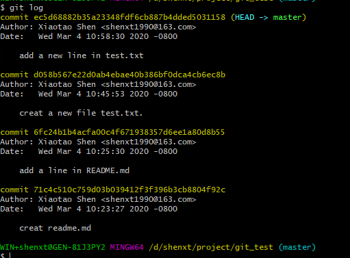

可以看到我们现在一共进行了4次提交,每次提交的第一行commit之后是该次提交的唯一`ID`.然后后面显示提交者,时间以及一些记录等.

如果提交非常多,需要显示内容精简一些,就需要使用`git log --pretty=oneline`命令.


### 版本回退

有了`git log`来查看提交的历史记录,我们就可以通过`git reset --hard`来退回到我们需要的某个特定版本.

```markdown
git reset --hard HEAD^ # 回退到上一个提交版本
git reset --hard HEAD^^ # 回退到上上一个提交版本
git reset --hard 'commit_id' # 会退到 commit_id 指定的提交版本
```
使用`git log`我们可以看到每个提交都有一个唯一的commit ID,其中上一个也可以使用`HEAD`代表.因此我们可以退回到上一个版本.比如,我们在最近的一次提交中修改了test.txt,在其中加入一行.


我们想退回到上一个版本,不想加入这一行,可以使用下面命令.

```markdown
git reset --hard HEAD^
```

这时候再查看log,可以看到最近的一个commit已经消失,回到了上一个提交.而上一次的修改也已经消失.


### 回到未来某个版本

退回到原来某个版本之后,如何再回到未来某个版本呢?还是使用`git reset --hard`命令,但是此时使用`git log`命令是无法显示在这之后的提交信息的。但是，通过`git reflog`可以获取到操作命令的历史。

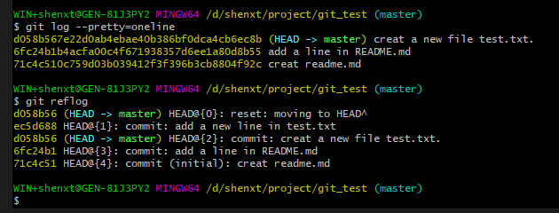

这时候只要在使用`git reset`命令就可以回到未来的任意一个版本了.而且这时候再使用`git log`也回到了最初的版本提交记录.


### 撤销修改

撤销修改同样包括两方面的内容，由于仓库中的文件在提交(commit)之前，可能在工作区中(也就是还未运行`git add`命令)，尚未在版本控制范围内，也可能在暂存区中(也就是运行了`git add`命令但是没有运行`git commit`命令)。

#### 丢弃工作区中的文件修改

使用如下命令.

```markdown
git checkout -- README.md    #如果 README.md 文件在工作区，则丢弃其修改
git checkout -- .            #丢弃当前目录下所有工作区中文件的修改
```

比如我们再`test.txt`中添加另外一行,然后不加入暂存区,然后将其丢弃掉.

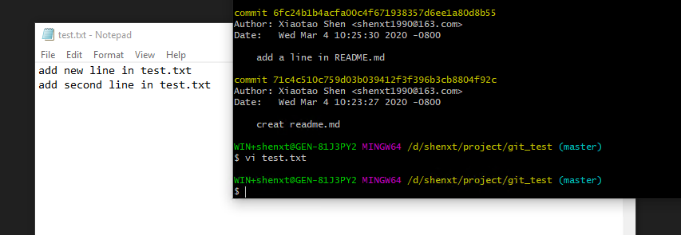

然后运行:

```markdown
git checkout -- test.txt
```


#### 丢弃暂存区的修改

如果已经运行了`git add`将修改放入了暂存区,可以通过下列命令进行丢弃:

```markdown
git reset HEAD README.md #将 README.md 恢复到 HEAD 提交版本的状态
git checkout -- README.md
```

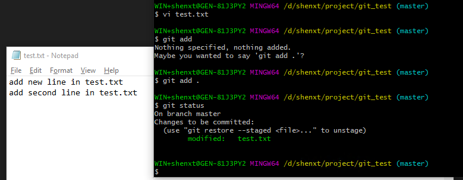

然后将其删除掉.

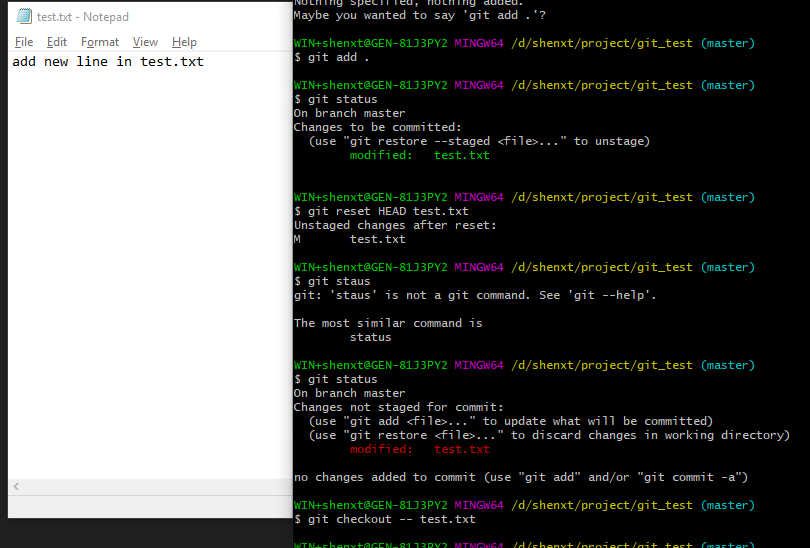

### 删除文件

在文件未添加到暂存区之前,对想删除文件可以直接物理删除.或者通过`git checkout -- file`来丢弃.如果文件已经被提交,则需要`git rm`来删除.

```markdown
git rm Readme.md #删除已经提交(commit)过的文件
```

> 注意: `git rm`只能删除已经提交到版本库中的文件.其他状态的文件直接用这个命令操作是出错的.

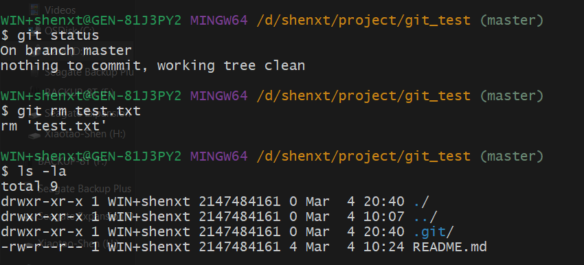


## git的分支管理

分支管理是版本管理中的重要概念.在进行多个并行作业时,我们经常会用到分支.在这类并行开发的过程中,往往同时存在着多个最新的代码状态.

master分支时git默认创建的分支.因此基本上所有的开发都是以这个分支为中心进行的.

在不同分支中,可以同时进行不同的作业,等该分支的作业完成之后,再与master分支进行合并.

比如下图中,我们首先以master作为模板复制得到`feature A`的分支.`feature A`分支主要用来开发另外一个新的特性,等开发完毕之后,再将其合并到master分支中即可.

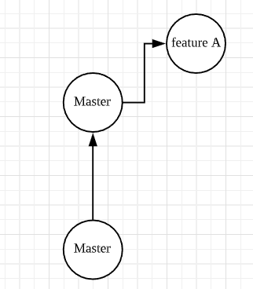


### 查看分支

使用`git branch`命令查看分支信息.

```markdown
git branch        #查看本地分支信息
git branch -v     #查看相对详细的本地分支信息
git branch -av     #查看包括远程仓库在内的分支信息
```


可以看到我们现在只有一个分支,也就是master,然后星号标识的就是当前所在的分支.

### 创建分支

使用 `git branch new.name`用来创建新的分支.

```markdown
git branch development ##创建一个新的名字叫做development的分支
```

> 需要注意的是,在哪个分支下面新建分支,则该分支就是copy自当前所在的分支.

### 切换分支

使用`git checkout`命令来切换分支.比如我们先新建一个development的分支,然后切换到该分支下.

```markdown
git branch development
git checkout development
```

当然也可以使用下面命令直接创建并切换到新建的分支下.

```markdown
git checkout -b development
```

### `switch`命令

我们注意到切换分支使用`git checkout <branch>`,而前面讲过的撤销修改则是`git checkout -- <file>`,同一个命令,有两种作用,确实有点令人迷惑.

实际上,切换分支这个动作,用`switch`更科学。因此，最新版本的Git提供了新的`git switch`命令来切换分支：

创建并切换到新的development分支,可以使用:

```markdown
git switch -c development 
```

直接切换到已有分支:

```markdown
git switch master
```


我们下面在development分支下面再新建一个`development.txt`文件,然后写入一些内容.


可以看到此时有一个新建的development.txt文件.如果我们切换到master分支,还是有该文件,但是对该文件内容进行修改,则因为没有加入到暂存区,因此并不会进行版本控制.

### 合并分支(merge)

当我们修复完成一个Bug,或者开发完成一个新特性,我们就会把相关的Bug或者特性的上修改合并回原来的主分支上,这时候就需要`git merge`命令来做分支的合并.

首先需要切换回最终需要合并的分支,也就是`master`分支,然后再合并.

```markdown
git checkout master   #切换回master分支
git merge development #将development分支中的修改合并回master分支
```
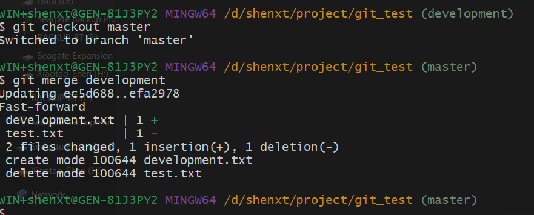

### 删除分支

当之前创建的分支,完成了它的使命,如Bug修复完,分支合并以后,这个分支就不在需要了,就可以删除它.

```markdown
git branch -d development #删除development分支
```

如果分支没有合并到master分支中,直接使用上面命令会报错,可以使用下面的命令强制删除.

```markdown
git branch -D development
```

### 分支提交冲突

如果新创建了一个分支`develpment`,然后在该分支下对`readme.txt`进行修改,然后提交.

随后然后切换到`master`分支,然后也对`readme.txt`进行修改,然后也提交.

这样,两个分支分别有了不同的提交.这种情况下,再进行合并就会有冲突.

我们合并一下试试:

```markdown

```

可以看到报错,Git告诉我们,`readme.txt`文件存在冲突,必须手动解决冲突后再提交.`git status`也可以告诉我们冲突的文件:

```
git status
```

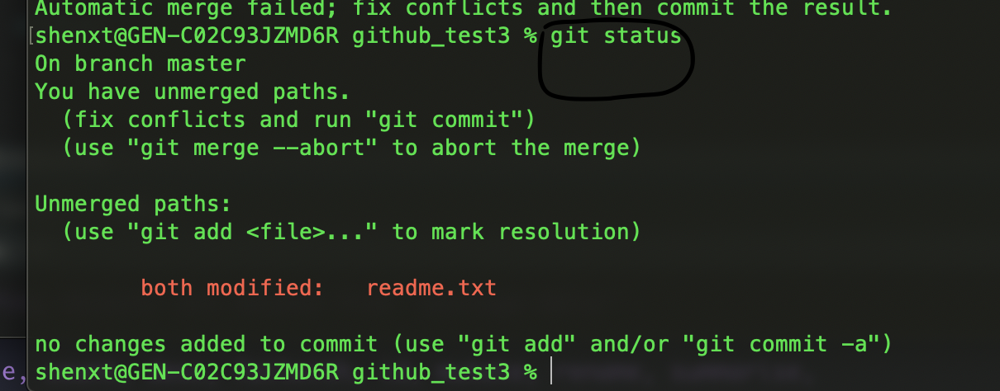

这时候我们可以使用`vi`或者其他工具打开冲突的文件,在这就是`readme.txt`:


Git用`<<<<<<<`，`=======`，`>>>>>>>`标记出不同分支的内容，我们修改如下后保存：

我们将这些记号删除,然后保留自己想要保留的修改就可.然后重新提交.

```markdown
git add .
git commit-m 'remove conflict'
```

这时候就完成了合并.可以删除development分支了.

这时候使用`git log`也可以看到分支的提交情况.使用`git log --graph`可以观察分支合并图.


### 分支策略

在实际开发中，我们应该按照几个基本原则进行分支管理：

首先，`master`分支应该是非常稳定的，也就是仅用来发布新版本，平时不能在上面干活；

那在哪干活呢？干活都在`dev`分支上，也就是说，`dev`分支是不稳定的，到某个时候，比如`1.0`版本发布时，再把`dev`分支合并到`master`上，在`master`分支发布1.0版本；

你和你的小伙伴们每个人都在`dev`分支上干活，每个人都有自己的分支，时不时地往`dev`分支上合并就可以了。


## 远程仓库(GitHub)

上面的所有命令都是针对本地仓库的操作.当我们希望多个人来协作时,会将代码发布到一个统一的远程仓库,然后多个人在本地操作以后,再推送到远程仓库.其他人协作时,需要先同步远程仓库的内容,再推送自己的修改.这就要用到了我们最常用的github.

### 添加到远程仓库

比如我们上面所建立的`git_test`本地仓库,我们需要将其添加到github的远程仓库中.

```markdown
git remote add origin your_remote_git_repo #为本地仓库添加远程仓库
```
其中`your_remote_git_repo`是在github中创建的.我们先创建一下,然后进行尝试.

格式为`git@github.com:user.name/repo_name`.
当然,也可以直接使用远程仓库的网址:

https://github.com/jaspershen/git_test

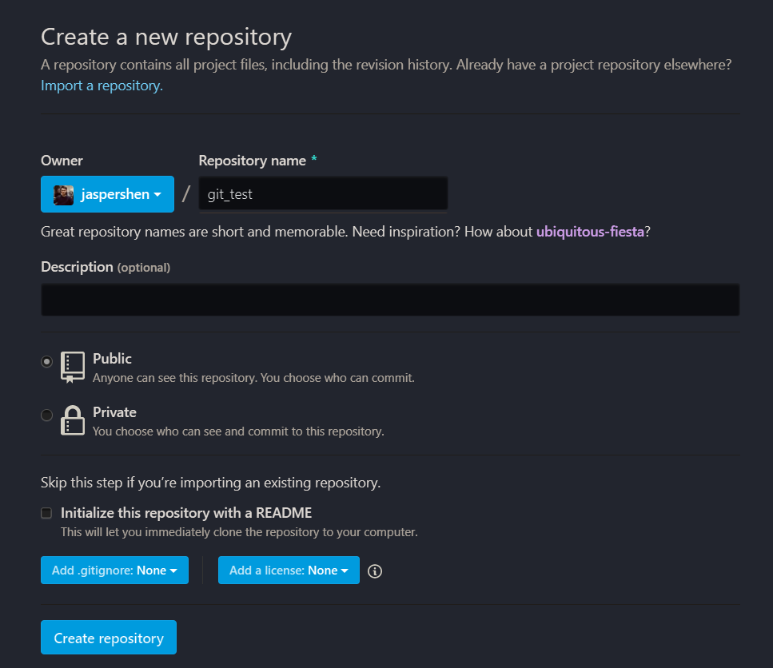

### 推送到远程仓库

使用`git push`将本地仓库的内容推送到远程仓库.

```markdown
git push -u origin master #第一次推送时使用,可以简化后面的推送或者拉取命令使用
git push origin master #将本地master分支推送到origin远程分支,后面之后就可以直接使用该命令推送
```


以后再推送的时候,就使用`git push`就可以了.

这时候可以看到github中已经有了内容.

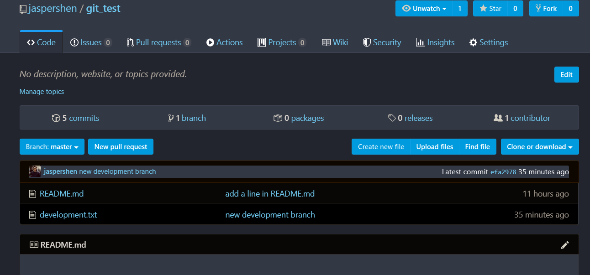

### 从远程仓库获取最新内容

在多人协作过程中,当自己完成了本地仓库中的提交,想要向远程仓库推送前,需要先获取到远程仓库的最新内容。

可以通过`git fetch`和`git pull`来获取远程仓库的内容.

```markdown
git fetch origin master    
git pull origin master
```

两者之间的区别:

* `git fetch`是仅仅获取远程仓库的更新内容,并不会自动做合并.

* `git pull`在获取远程仓库的内容后,会自动做合并,可以看成`git fetch`之后`git merge`.所以更推荐这个命令.

### 查看远程仓库信息

```markdown
git remote -v
```

### 从远程仓库克隆

如果你本地没有仓库,希望从已有的远程仓库上复制一份代码,那么你需要`git clone`.

```markdown
git clone https://github.com/jaspershen/git_test #通过 https 协议,克隆Github上git仓库的源码
git clone jaspershen@github.com/git/git_test #通过ssh协议,克隆Github上git仓库的源码
```

## 设置忽略文件

有时候仓库中的某些文件或者文件夹并不需要进行同步,这时候可以通过设置忽略文件`.gitignore`进行管理.

参考帖子:

https://github.com/onlynight/ReadmeDemo/tree/master/Readmes/GitIgnore

## 多人协作

### 创建远程仓库

在github创建远程仓库或者将本地仓库推送到远程仓库.这里就不在演示了.

### 本地创建分支并推送到远程仓库

比如我们在`jaspershen`账户上有一个远程仓库`test`,我们想要跟`shenxt`一起合作开发这个项目,那么`jaspershen`需要先创建一个`shenxt`分支.

```markdown
git branch shenxt
```

然后将该分支推送到远程仓库.

```markdown
git push origin shenxt
```

这时候再去远程仓库就可以看到`shenxt`分支了.

### 邀请合作者

在github远程仓库的`setting`中,点击`Manage access`,然后点击`invite collarbortor`,填入邀请人的ID即可.这时候邀请人可以在自己github中看到邀请,同意即可.

### 合作者参与项目

合作者同意邀请之后,需要克隆项目,创建本地分支.

### 克隆项目

```markdown
git clone git@github_jaspershen:shenxt/github_test4.git
cd github_test4
```

这时候查看分支,

```markdown
git branch
```

会看到只有master分支.所以要创建远程仓库的分支到本地.

```markdown
git checkout -b jaspershen origin/jaspershen
```

这时候再查看分支,就会在`jaspershen`分支了.这时候合作者jaspershen就可以在该分支下进行工作了.

### 开始工作

这时候合作者`jaspershen`可以在分支下正常工作,然后提交,合并,并推送到远程仓库.

* 创建文件

```markdown
touch heloworld.txt
```
然后在该文件下写入一行文字:

```markdown
test from jaspershen
```

* 提交

然后加入到暂存区并提交.

```markdown
git add helloworld.txt
git commit -m "test from jaspershen"
```

* 合并分支

```
git checkout master
git merge jaspershen
```

* 推送到远程仓库

然后可以将其推送到远程分支(包括master和jaspershen分支).注意是直接推送到`shenxt`账户的远程仓库.

```markdown
git push origin master
git push origin jaspershen
```

这时候就可以在`shenxt`的远程仓库下看到`jaspershen`的提交工作了.

### 有冲突怎么办

多人协作是不免会有冲突,冲突的主要原因就是对同一文件的修改,所以最好是提前说好不要对同一个文件进行修改,如果有冲突,请参考:

https://www.liaoxuefeng.com/wiki/896043488029600/900004111093344

### 抓取分支

多人协作时，大家都会往`master`分支上推送各自的修改。如果两个人同时对同一个文件进行了修改,并且同试图推送到`master`分支,那么就会冲突,报错.这时候,应该先使用`git pull`命令将最新的提交从`origin/master`下抓取下来,然后本地合并,解决冲突,再推送.

比如我们在`shenxt`账户下也创建一个`helloworld.txt`文件.然后提交,推送到远程仓库.

```markdown
git push origin master
```

会得到下面的报错:

```
 ! [rejected]        master -> master (fetch first)
error: failed to push some refs to 'git@github_shenxt:shenxt/github_test4.git'
hint: Updates were rejected because the remote contains work that you do
hint: not have locally. This is usually caused by another repository pushing
hint: to the same ref. You may want to first integrate the remote changes
hint: (e.g., 'git pull ...') before pushing again.
hint: See the 'Note about fast-forwards' in 'git push --help' for details.
```

我们先使用`git pull`抓取分支的最新提交.

```markdown
git pull
```
也失败了,因为没有指定本地分支与远程`origin/xxx`分支的链接，根据提示，设置本地分支和远程分支的链接：


```markdown
git branch --set-upstream-to=origin/master master
git branch --set-upstream-to=origin/jaspershen jaspershen
```


然后在pull.

这回`git pull`成功，但是合并有冲突，需要手动解决，解决的方法和分支管理中的解决冲突完全一样。解决后，提交，再`push`：

### 多人协作的工作模式

1. 首先，可以试图用`git push origin <branch-name>`推送自己的修改；

2. 如果推送失败，则因为远程分支比你的本地更新，需要先用`git pull`试图合并；

3. 如果合并有冲突，则解决冲突，并在本地提交；

4. 没有冲突或者解决掉冲突后，再用`git push origin <branch-name>`推送就能成功！

5. 如果`git pull`提示`no tracking information`，则说明本地分支和远程分支的链接关系没有创建，用命令`git branch --set-upstream-to <branch-name> origin/<branch-name>`。

这就是多人协作的工作模式，一旦熟悉了，就非常简单。

## How to work together use git and github for metID (for Han)


### Set up you git and github

Make sure you have installed github desktop in you mac.

Open you terminal, and then type this code to set up you local git account:

```markdown
git config --global user.name your_github_user_name
git config --global user.email your_github_user_email
```

After you set up your github account, then try to confirm if you are successful:

```markdown
git config --global user.name
git config --global user.email
```

Then, you should set up a SSH with you local git and github, still in your terminal:

```markdown
#chang directory
cd ~/.ssh
ssh-keygen -t rsa -C "your_github_email"
```

Then open your `/ssh` folder, and you will see there is a `id_rsd.pub`. Open this file and copy all the content. Go to you github website, in the right top concer, cliker your picture, and then select `Settings`. Then select `SSH and GPG keys`, and then click `New SSH key`. For the `Title`, just type a name you want, and then paste the keys you copied from `id_rsd.pub` to the key area. And then click `Add SSH key`.


### Accept the invitation

I will send a collaborator invitation email to Han, you will receive this email and please recept the inviation.


### Git clone the repository

Open you terminal, and then set to the work directoy you want to keep the metID. Then type this code to clone the metID repo:

```markdown
git clone git@github.com:jaspershen/metID.git
```

Then change you work directory into `metID` folder:

```markdown
cd metID
```

Then check you branch: 

```branch
git branch
```

You will find you only have the master branch. Then chnage to `hanyah` branch:

```markdown
git checkout -b hanyah origin/hanyah
```

Then you can see that you are in branch already:

```
gitbranch
```

### Add the repo into the github desktop

Open you github desktop. And open you `Preferences`, and then sign in.

Then click `File`, and select `Add Local Repository`, and then choose the local `metID` package in your mac.

Now you can use github desktop to manage your metID repository.

### Begin to work

Now please open your Rstudio, and open the `metID` project. Now you can work with metID.

### Push your work to github

After your finish a file or document, and then you can open your github desktop, you can see what you have changed in your documents or files. And then please type some note in your summary, and then click `Commit to hanyah`. And then push them to github by click `Fetch origin`.

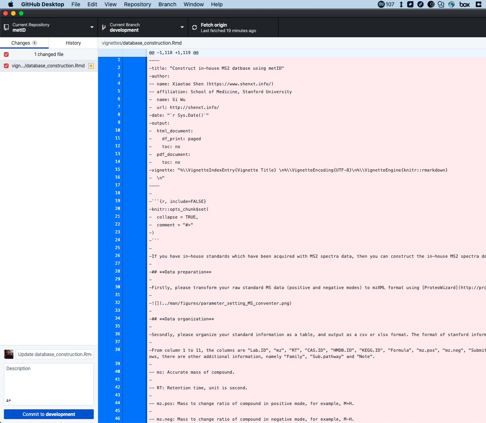

---

<div id="disqus_thread"></div>
<script>

/**
*  RECOMMENDED CONFIGURATION VARIABLES: EDIT AND UNCOMMENT THE SECTION BELOW TO INSERT DYNAMIC VALUES FROM YOUR PLATFORM OR CMS.
*  LEARN WHY DEFINING THESE VARIABLES IS IMPORTANT: https://disqus.com/admin/universalcode/#configuration-variables*/
/*
var disqus_config = function () {
this.page.url = PAGE_URL;  // Replace PAGE_URL with your page's canonical URL variable
this.page.identifier = PAGE_IDENTIFIER; // Replace PAGE_IDENTIFIER with your page's unique identifier variable
};
*/
(function() { // DON'T EDIT BELOW THIS LINE
var d = document, s = d.createElement('script');
s.src = 'https://r-cookbook-shen.disqus.com/embed.js';
s.setAttribute('data-timestamp', +new Date());
(d.head || d.body).appendChild(s);
})();
</script>
<noscript>Please enable JavaScript to view the <a href="https://disqus.com/?ref_noscript">comments powered by Disqus.</a></noscript>
                            
