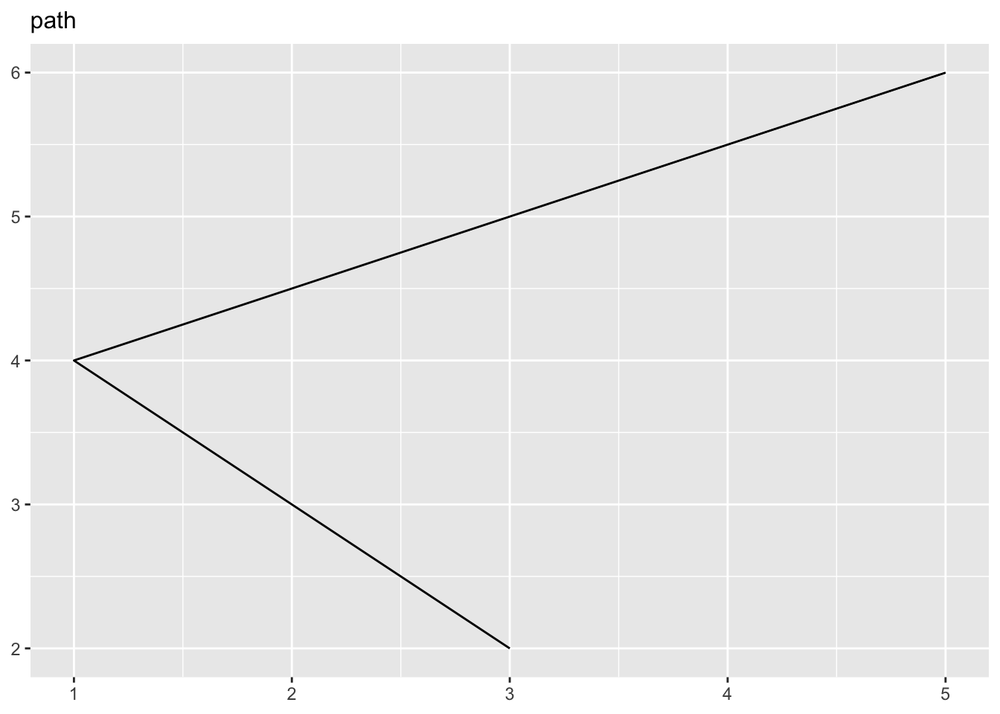
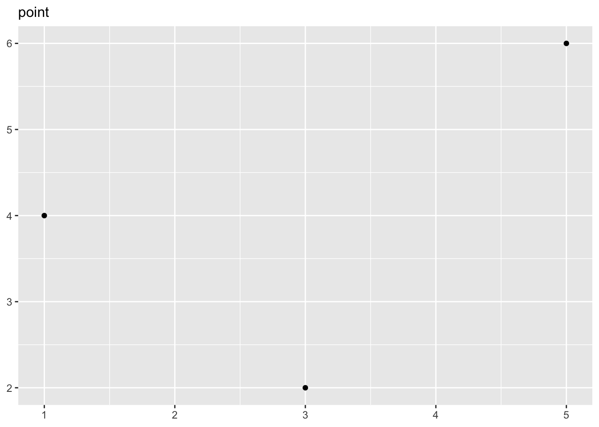
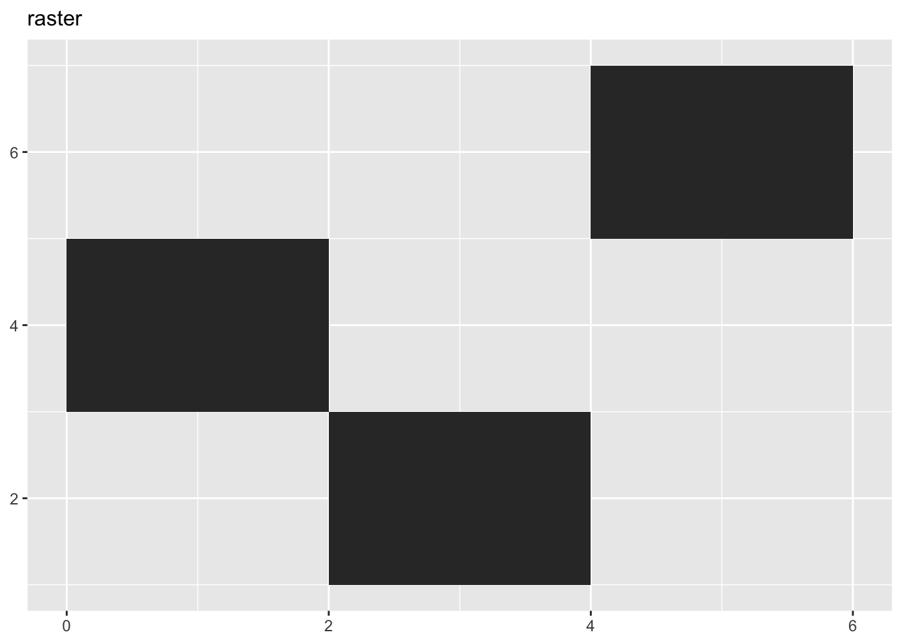
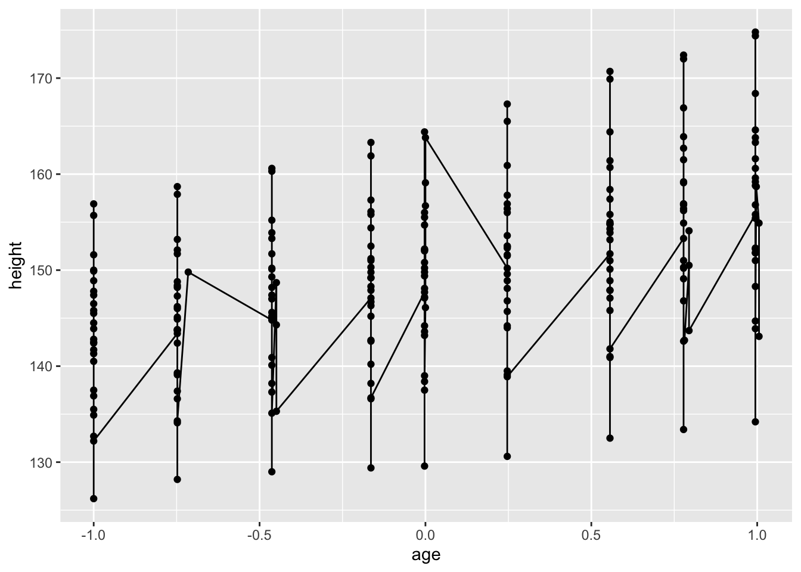
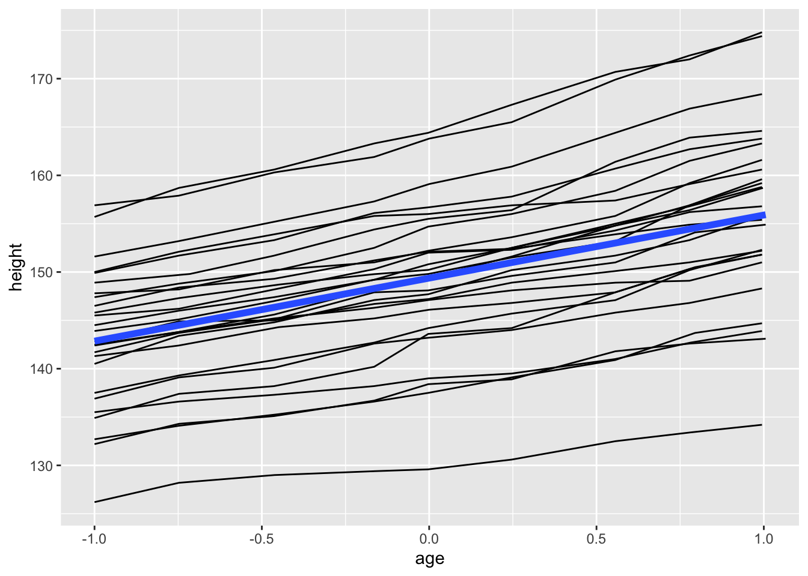
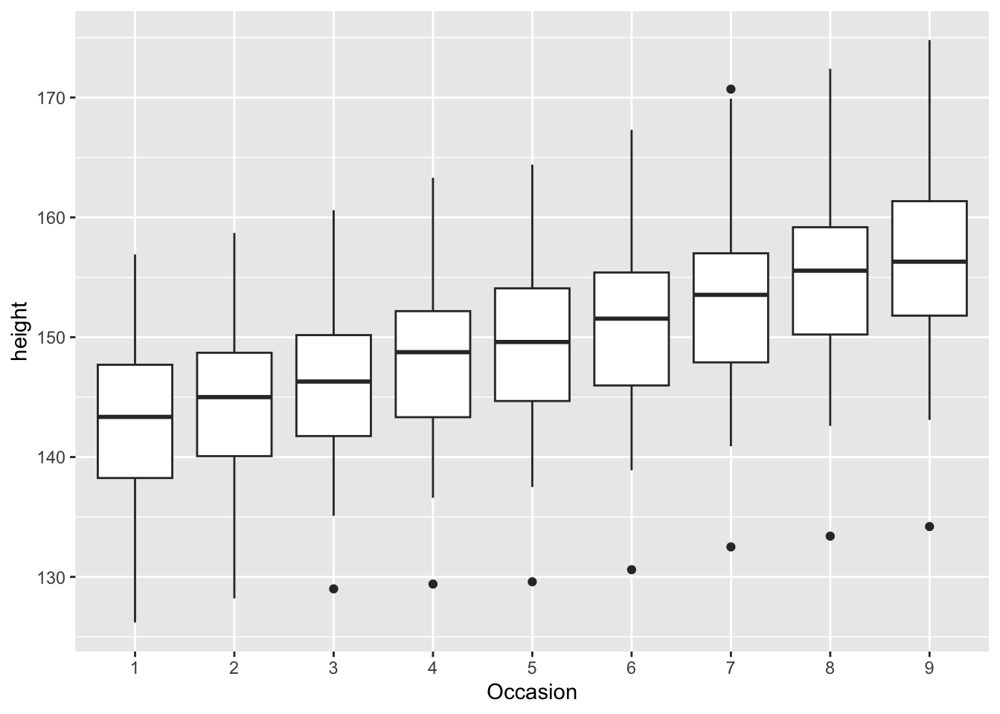
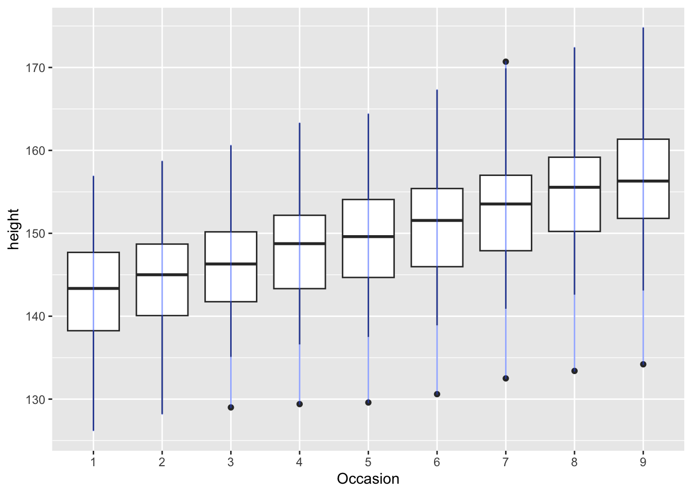

# ggplot2 {#ggplot2}

推荐查看作者写的英文书:

https://ggplot2-book.org/

## 安装


```r
install.packages("ggplot2")
```

## 基础知识

### ggplot图像的三个元素

每个`ggplot`都有三个元素组成:

* 数据(data)

在`ggplot2`中,数据一般是data frame(数据框).

* 一系列的美学映射(aesthetic mappings),将数据的变量和可视化的特征联系起来.

aesthetic mappings,直译为美学映射.也就是将数据的变量使用哪种图形属性进行表示.比如最为简单的一副散点图,我们可以使用x轴来表示身高,使用y轴表示体重,然后使用每个点的颜色代表性别.

* 至少一个图层(layer)用来描述变量如何展示,也就是几何对象(geometric).图层一般使用前缀为`geom_`的函数进行创建.

一个简单的例子:


```r
library(ggplot2)
ggplot(mpg, aes(x = displ, y = hwy)) + 
  geom_point()
```


这幅图中:

1. 数据为`mpg`

2. 美学映射:`displ`映射到x轴,`hwy`映射到y轴.

3. 图层:点图.

`aes()`函数的前两个参数默认是`x`和`y`.

### 颜色,性状,大小和其他的美学属性(aesthetic attributes)

为了在一幅图中将=映射更多的变量,我们可以使用一些其他的美学属性(aesthetic attributes).比如,颜色,性状还有大小.

比如,将颜色映射到变量`class`上:


```r
ggplot(mpg, aes(displ, cty, colour = class)) + 
  geom_point()
```


如果想要将某个美学属性设置为固定值,应当在`aes`函数之外进行设置:


```r
ggplot(mpg, aes(displ, hwy)) + geom_point(aes(colour = "blue"))
ggplot(mpg, aes(displ, hwy)) + geom_point(colour = "blue")
```


可以看一下这两幅图的差异.

### 分面(Facetting)

分面也是一种展示分类变量的方法.

`ggplot2`中有两种分面方式:`grid`和`wrapped`.其中`wrapped`.其中wrapped更为重要.需要使用`facet_wrap()`函数.


```r
ggplot(mpg, aes(displ, hwy)) + 
  geom_point() + 
  facet_wrap(~class)
```


### 图形的图层(geom)

图层(geom)就是用来决定变量如何展示在图像上的办法.比如最常见的最简单的点图的图层就是`geom_point()`.

* `geom_smooth`: 对数据进行拟合.

* `geom_boxplot`:箱形图.

* `geom_histogram`:对连续变量分布进行描述.

* `geom_bar`:barplot.

1. 在图中添加smooth曲线


```r
ggplot(mpg, aes(displ, hwy)) + 
  geom_point() + 
  geom_smooth()
#> `geom_smooth()` using method = 'loess' and formula = 'y ~
#> x'
```


## 单独几何对象(individual geoms)

### 基础图形

如何理解几何对象?可以理解为图形的表现方式.我们平时所说的散点图(scatter plot),箱形图(box plot)或者柱状图(bar plot)其实就是指的不同的几何对象表现方式.

基础的几何对象都是二维的并且需要`x`和`y`轴美学映射.他们也都能够使用颜色(color)和形状(shape)对变量进行映射.

* `geom_area()`: 该几何对象用来绘制面积图.线条下面使用颜色进行填充.


```r
df <- data.frame(
  x = c(3, 1, 5), 
  y = c(2, 4, 6), 
  label = c("a","b","c")
)
p <- ggplot(df, aes(x, y, label = label)) + 
  labs(x = NULL, y = NULL) + # Hide axis label
  theme(plot.title = element_text(size = 12)) # Shrink plot title
```


```r
p + geom_area() + ggtitle("area")
```


* `geom_bar(stat = "identity")`: 绘制bar plot.注意我们需要将其中的参数`stat`设置为`identify`,因此默认情况下,其会统计x轴变量的个数作为y轴.


```r
p + geom_bar(stat = 'identity') + ggtitle("bar")
```


* `geom_line()`: 绘制线形图.将点按照从左到右顺序进行连接.`geom_path()`函数与`geom_line()`类似,但是连接线的方式是按照他在数据中的顺序进行连接.


```r
p + geom_line() + ggtitle("line")
p + geom_path() + ggtitle("path")
```



* `geom_point()`用来画散点图.所以可以对点设置`shape`属性.


```r
p + geom_point() + ggtitle("point")
```




* `geom_polygon()`,该函数用来绘制多边形.多边形的每个顶点都需要数据中的单独一行来定义.


```r
p + geom_polygon() + ggtitle("polygon")
```


* `geom_rect()`,`geom_title()`和`geom_raster()`用来绘制长方形(rectangles).其中,`geom_rect()`使用四个参数来确定长方形的四个角(`xmin`,`xmax`,`ymin`和`ymax`).`geom_title()`和`geom_rect()`几乎相同,但是使用参数`x`和`y`来定义每个长方形的中心,然后使用`width`和`height`来定义每个长方形的宽度和高度.`geom_raster()`和`geom_title()`几乎相同.如果每个长方形的大小都是一致的,那么更推荐使用它,因为速度会快一些.


```r
p + geom_tile() + ggtitle("raster")
```




## 复杂几何对象(collective geoms)

不知道这个怎么翻译比较恰当.所有的集合对象(geom)都可以简单粗略的分为简单对象和复杂几何对象.对于简单的集合对象来说,数据的每一个观测(也就是一行),只画成一个独立的图形.比如对于散点图,每一行数据,只画一个点.而一个复杂的几何对象(collective geom)则使用几行数据来画出一个图形.这有可能是因为统计,比如boxplot,很多点才画出一个box.也有可能是图像的显示方式决定的,比如对于多边形,只有几个点才能确定一个多边形.

下面的例子我们使用`nlme` package的`Oxboys`数据进行演示.


```r
data(Oxboys, package = "nlme")
head(Oxboys)
#> Grouped Data: height ~ age | Subject
#>   Subject     age height Occasion
#> 1       1 -1.0000  140.5        1
#> 2       1 -0.7479  143.4        2
#> 3       1 -0.4630  144.8        3
#> 4       1 -0.1643  147.1        4
#> 5       1 -0.0027  147.7        5
#> 6       1  0.2466  150.2        6
```

### 多个组一个美学属性(aesthetic)

有时候,我们希望将数据分成不同的组别进行画图.但是画出的图都是同样的美学属性.也就是说,你希望对每一个对象进行单独画图.这在一些longitudinal研究中非常常见.比如我们想要看每一个男孩随着时间身高的变化:


```r
ggplot(Oxboys, aes(age, height, group = Subject)) + 
  geom_point() + 
  geom_line()
```


每一条线代表一个男孩,一个对象.如果我们不适用`group`参数进行设置,那么出来的结果就是下面这样:


```r
ggplot(Oxboys, aes(age, height)) + 
  geom_point() + 
  geom_line()
```



另外还有一个比较有用的参数,如果对于对象并没有一个单独的group进行定义,那么就可以使用`interaction()`函数进行定义,比如:`aes(group = interaction(school_id, student_id))`.

### 多组并且多个图层(layer)

有时候我们还想对每个对象单独画图,但是需要对整体进行总结.这时候我们就需要知道怎么在`ggplot2`中设置`整体数据(global)`和`特殊数据(specific data)`.

我们看到,我们都需要使用`ggplot()`参数来创建一个ggplot2图像,在`ggplot()`函数中设置的数据和参数称之为整体数据和整体参数,这些数据会在所有的图层中都使用.如果想要在不同的图层中使用不同的数据和参数,那么就需要在不同的图层或者说集合对象中设置数据和参数.


```r
ggplot(Oxboys, aes(age, height)) + 
  geom_line(aes(group = Subject)) + 
  geom_smooth(method = "lm", size = 2, se = FALSE)
#> `geom_smooth()` using formula = 'y ~ x'
```



## 覆盖默认分组

有一些图形的横坐标为非连续变量,但是我们仍然想要画一条线将他们连接起来.比如对于boxplot:


```r
ggplot(Oxboys, aes(Occasion, height)) + 
  geom_boxplot()
```



横坐标是非连续变量,如果我们想使用一条线将所有的人都连接起来该怎么做呢?


```r
ggplot(Oxboys, aes(Occasion, height)) + 
  geom_boxplot() +
  geom_line(colour = "#3366FF", alpha = 0.5)
```



可以看到上面并不是我们想要的结果,如果想要得到我们想要的结果,需要在`geom_line()`函数中再次单独定义`group`.


```r
ggplot(Oxboys, aes(Occasion, height)) + 
  geom_boxplot() +
  geom_line(aes(group = Subject), colour = "#3366FF", alpha = 0.5)
```


上面是我们想要的结果.

### 将美学属性match到图形对象上


```r
df <- data.frame(x = 1:3,
                 y = 1:3,
                 colour = c(1, 3, 5))
ggplot(df, aes(x, y, colour = factor(colour))) +
  geom_line(aes(group = 1), size = 2) +
  geom_point(size = 5)
```


这幅图中,colour是非连续变量.第一个点和第一条线是红色的.第二条线和第二个点事绿色的,第三个点(没有对应的线)则是蓝色的.


```r
ggplot(df, aes(x, y, colour = colour)) +
  geom_line(aes(group = 1), size = 2) +
  geom_point(size = 5)
```


这幅图中colour是连续的.

---

<div id="disqus_thread"></div>
<script>

/**
*  RECOMMENDED CONFIGURATION VARIABLES: EDIT AND UNCOMMENT THE SECTION BELOW TO INSERT DYNAMIC VALUES FROM YOUR PLATFORM OR CMS.
*  LEARN WHY DEFINING THESE VARIABLES IS IMPORTANT: https://disqus.com/admin/universalcode/#configuration-variables*/
/*
var disqus_config = function () {
this.page.url = PAGE_URL;  // Replace PAGE_URL with your page's canonical URL variable
this.page.identifier = PAGE_IDENTIFIER; // Replace PAGE_IDENTIFIER with your page's unique identifier variable
};
*/
(function() { // DON'T EDIT BELOW THIS LINE
var d = document, s = d.createElement('script');
s.src = 'https://r-cookbook-shen.disqus.com/embed.js';
s.setAttribute('data-timestamp', +new Date());
(d.head || d.body).appendChild(s);
})();
</script>
<noscript>Please enable JavaScript to view the <a href="https://disqus.com/?ref_noscript">comments powered by Disqus.</a></noscript>
                            
